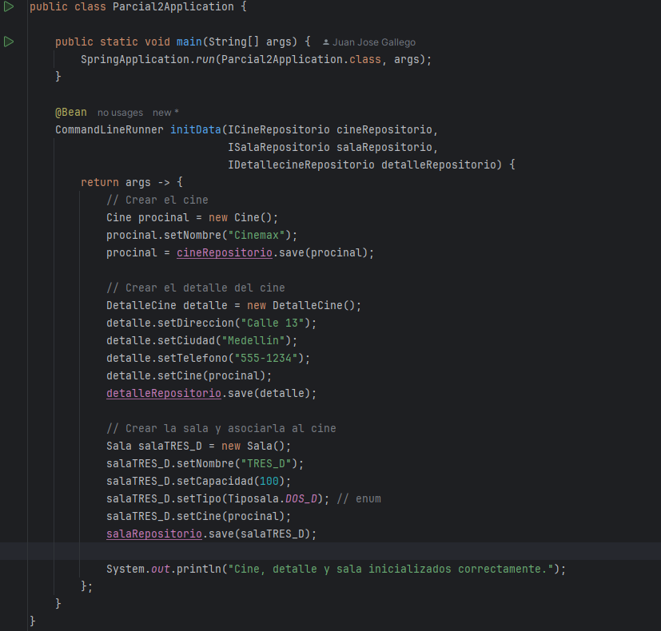
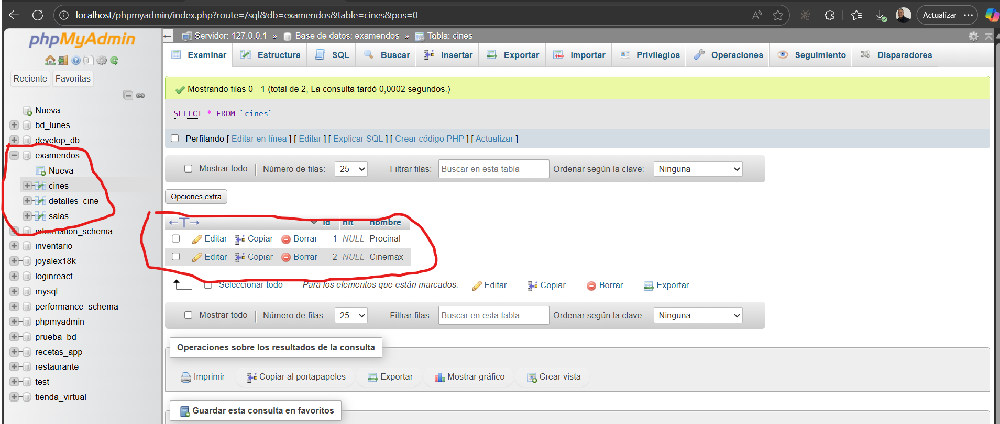

README del examen
1. se trabajo en el area del pom , asi solucionando problemas de dependencia para hacer la conexion a la base de datos
2. 
3. como tercero y este segundo commit se creo una ayuda para las salas , aparte tambien se crearon las dtos 
4. se trabajo en el mapas y en los repositorios 
5. por ultimo se creo los servicios de cada uno 
6. tambien se hice una consulta para saber si si guardaba la informacion la cual se alico en la clase parcial2aplcation 
7. 
8. con el cual al ejecutar se va a guardar la informacion en la base de datos 
9. 