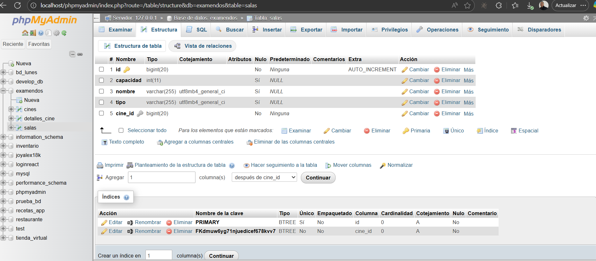

README del examen
1. se trabajo en el area del pom , asi solucionando problemas de dependencia para hacer la conexion a la base de datos
2. 
3. como tercero y este segundo commit se creo una ayuda para las salas , aparte tambien se crearon las dtos 
4. se trabajo en el mapas y en los repositorios 
5. 